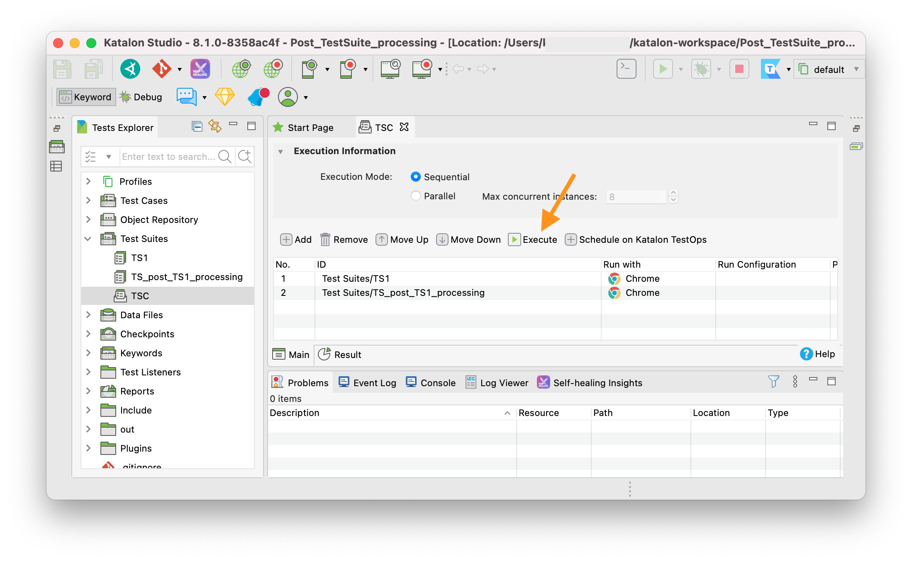
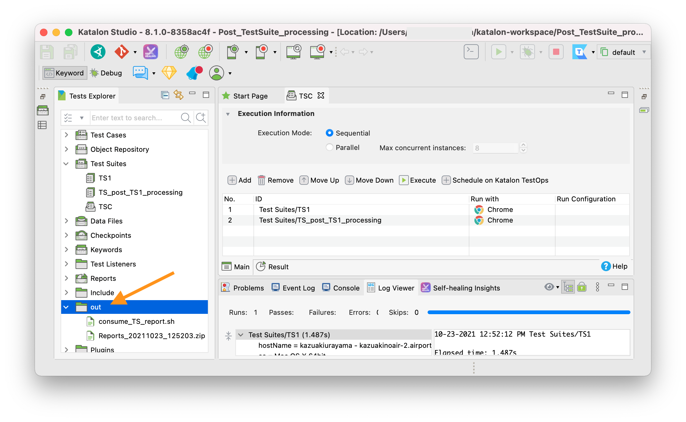
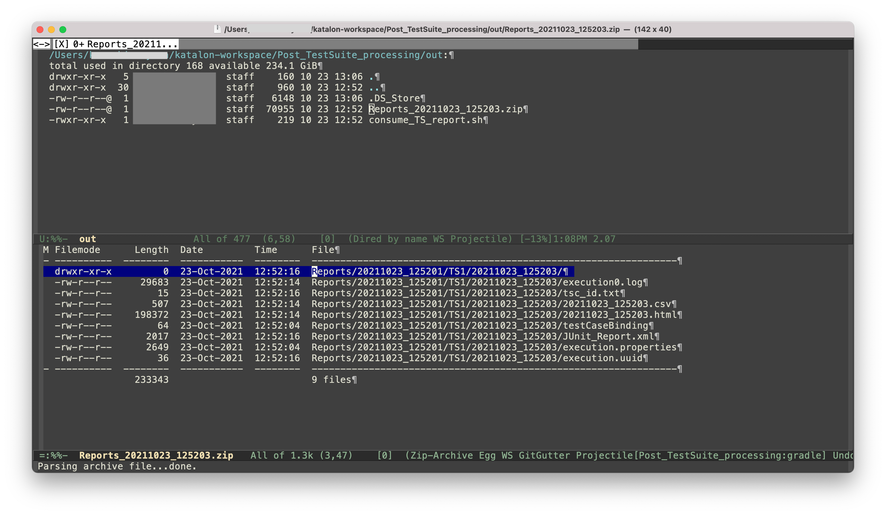

Post Test Suite Processing --- how to zip the Report Folder in Katalon Studio
====

This is a small [Katalon Studio](https://www.katalon.com/katalon-studio/) project for demonstration purpose.

You can download the zip at the [releases page](https://github.com/kazurayam/Post_TestSuite_processing/releases).

This project was developed using Katalon Studio v8.1.0 but is not dependent on the KS version.
It should work on every versions of KS.

This project is meant to propose a solution to the discussion raised in Katalon Forum at

- [How to zip the Report Folder](https://forum.katalon.com/t/how-to-zip-the-report-folder/58763)

## Caution

I used Mac. This project assumes that `/bin/sh` command is available, which is usually true on Mac and Linux. You should be able to rewrite this for Windows + PowerShell environment easily.

## Demonstration

This project demonstrates how automate making a zip file of Reports generated by a Test Suite execution.

Please download this project, open it with your local Katalon Studio, run a Test Suite Collection named `TSC`. Just run it to see what `TSC` does.

1. Open a Test Suite Collection named `Test Suites/TCS`. It comprises with 2 Test Suites.
  * `Test Suites/TS1`
  * `Test Suites/TS_post_TS1_processing`
2. Click the Execute button to run it. It will run for a few seconds. 
3. The `TS1` will run for a few second and pass, but `TS_post_TS1_proocessing ` will fail. It fails intentionally for demostration purpose. Don't mind it.
4. Once `TSC` finished, a folder named `out` will be be created under the project directory. 
>However, Katalon Studio has a bug; *the newly created `out` folder will not be visible in the Test Explorer pane*. So, please close the project once and reopen it in order to let Katalon Studio be acknowled of the new `out` folder. 
5. In the `out` folder, you will find two files created by the `TSC`. 
  * `out/consume_TS_report.sh`
  * `out/Reports_yyyyMMdd_hhmmss.zip`
  >Here `yyyyMMdd_hhmmss` represent a varying time stamp.
6. Please check the content of the `Reports_yyyyMMdd_hhmmss.zip` file using your favorite archiver software. In the zip file, you will find the test report in HTML/CSV/XML generated by a Test Suite named `Test Suites/TS1`. 
8. `TSC` calls `Test Suite/TS1`, which calls a Test Case `TC1`. `TC1` is a skeltal Test Case example, like this:
```
import com.kms.katalon.core.webui.keyword.WebUiBuiltInKeywords as WebUI

WebUI.comment("Here you can do whatever you like")
```
9. Katalon Studio will generate a set of reports of `Test Suite/TS1` into the folder `Reports/yyyyMMdd_hhmmss/TS1/yyyyMMdd_hhss2`.
10. After `TS1`, `TSC` calls one more Test Suite `TS_post_TS1_processing`. It will make a zip file in the `out` folder at `out/Reports_yyyyMMdd_hhmmss.zip`.

In short, the `TSC` demonstrates that the Test Suite `TS_post_TS1_processing` makes a zip file of the Reports generated by the Test Suite `TS1`.

## Problem to solve

Why I developed this demo project? Let me tell it you. Katalon Studio users often want to make a zip file of the Reports of a Test Suite execution. If you don't mind doing it manually after a Test Suite finished, you can:

1. In Windows Explorer GUI, open the project folder
2. Dig the folder tree to reach `<projectDir>/Reports/yyyyMMdd_hhmmss/testSuiteName/yyyyMMdd_hhmmss2` folder
3. Right-click the folder and choose "archive it" menu.
4. You are done. You will get a zip file which contains HTML/CSV/XML reports.

But I don't like to do it manually. I want to **automate zipping the Reports**. Not only creating the file, I want to do more. For example, I want to transfer the zip to some remote storage for further processing.

How can I do it in a Katalon Studio project?

## Technical difficulties

I found 3 technical issues that I had to overcome.

### Timing issue

People naively expects that HTML/XML reports of a Test Suite `TS1` to be present and accessible in the Report folder when the `@AfterTestSuite`-annotated method in a TestListener is invoked. Unfortunately the fact is not the case. When a `@AfterTestSuite`-annotated method is invoked, the HTML/XML reports are not present there yet.

I can show you a proof.

When you run the Test Suite Collection `TSC`, you should be able to find the following messages in the Console.

```
TS1ReportDirLister output ----------------------------------------------
executing: ls -la ./Reports/20211023_172734/TS1/20211023_172736
return code = 0
total 40
drwxr-xr-x  6 kazuakiurayama  staff    192 Oct 23 17:27 .
drwxr-xr-x  3 kazuakiurayama  staff     96 Oct 23 17:27 ..
-rw-r--r--  1 kazuakiurayama  staff   2649 Oct 23 17:27 execution.properties
-rw-r--r--  1 kazuakiurayama  staff  11108 Oct 23 17:27 execution0.log
-rw-r--r--  1 kazuakiurayama  staff      0 Oct 23 17:27 execution0.log.lck
-rw-r--r--  1 kazuakiurayama  staff     64 Oct 23 17:27 testCaseBinding
```

This message is emitted by [Test Listeners/TS1ReportDirLister](Test Listeners/TS1ReportDirLister.groovy). It executes a Command `ls -la ./Reports/20211023_172734/TS1/20211023_172736` in the `@AfterTestSuite`-annotated method. As you can see in the report folder, there is a bulky `execution0.log` file butno HTML/XML reports are there yet.

Katalon Studio will compile HTML/XML report after `@AfterTestSuite`-annotated method finished. Therefore the `@AfterTestSuite`-annotated method after `TS1` can not make a zip file of the reports of `TS1`.

### Variable path

In order to write a script to zip a folder, the script must know the path of target folder. On the other hand, Katalon Studio assigns the path of a report folder for `TS1` like:

- `Reports/20211023_125201/TS1/20211023_125203`

As you can see, this path has variable parts (time stamp). How can my script find the concrete value of the variable folder path?

### How to run a Command from Groovy

In order to create a zip file of a folder contents, I want to use the good old bash shell commands: `zip`, `mv`, `cp`, `rm`, `mkdir`, `echo` etc. Also I want to use `curl` command to transfer files over network.

I will create, by Groovy script (TestListener), a shell script file named `consume_TS_report.sh`. Then, how can I execute that shell script with `/bin/sh` (bash shell interpreter) from my Groovy script (TestCase)?

## Proposed solution

### Resolving timing issue

You can not make a zip of the Test Suite `TS1` by TS1 itself. Possible solution is to create another Test Suite `TS_post_TS1_processing`. You want to create a Test Suite Collection `TSC` and let it call `TS1` and `TS_post_TS1_processing` sequentially in this order. At the timing when `TS_post_TS1_processing` is activated, the reports of `TS1` has been already compiled. The following Test Suites should be able to read the reports.

### Resolving variable report folder path issue

[`com.kms.katalon.core.configuration.RunConfiguration`](https://docs.katalon.com/javadoc/com/kms/katalon/core/configuration/RunConfiguration.html) class implements [String getReportFolder()](https://docs.katalon.com/javadoc/com/kms/katalon/core/configuration/RunConfiguration.html#getReportFolder()) method. With this method call, we can get to know the report folder path of the current Test Suite.

### Resolving how to run command from Groovy

The `java.lang.ProcessBuilder` class enables running arbitrary commands in a new process from Groovy script. The following article covers how to use it.

- [How to run a Shell command in Java](https://www.baeldung.com/run-shell-command-in-java)

However I found that ProcessBuilder is difficult to use for simple use cases. So I have developed a small wrapper for ProcessBuilder named `subprocessj`.

The [jar](Drivers/subprocessj-0.1.0.jar) is already bundled in the `Drivers` folder of this Git project.

You can download the jar of `subprocessj` from the Maven Central repository.
- https://mvnrepository.com/artifact/com.kazurayam/subprocessj

The tutorial of `subprocessj` is here:
- https://kazurayam.github.io/subprocessj/

The source code of `subprocessj` is hosted here:
- https://github.com/kazurayam/subprocessj

## Description

### First half

When you run the Test Suite Collection `TSC` and when the Test Suite `TS1` has finished, the [Test Listeners/PostTS1Processor](Test%20Listeners/PostTS1Processor.groovy) will be invoked. It has `@AfterTestSuite`-annotated method. Please read the source.

What is the method does ?

1. if the Test Suite `TS1` has been finished,
2. in the `out` folder, create a file named `consume_TS_report.sh`
3. identify the path of report folder
4. the sh file contains a few lines of bash shell scripts for the following sub-processing:
  * make a zip file of the report folder
  * move the zip file into the `out` folder
  * try to transfer the zip file by HTTP POST request to a remote URL
5. do `chmod +x consume_TS_report.sh` to change its permission and make it executable in the commandline.

The `out/consume_TS_Report.sh` is something like the following:

```
zip Reports_20211023_172736 -r "Reports/20211023_172734/TS1/20211023_172736"
mv Reports_20211023_172736.zip "out/"

# I know this would fail
curl -X POST https://localhost:80 -F 'file=@out/Reports_20211023_172736.zip'
```

### Second half

The Test Suite Collection `TSC` will call the Test Suite `TS_post_TS1_processing` after `TS1`.

`TS_post_TS1_processing` calls a Test Case [`TC_consume_TS1_report`](Scripts/TC_consume_TS1_report/Script1634894058026.groovy).

What this test case does? For the detail, read the source code.

1. The test case script locates the `out/consume_TS_report.sh`
2. It forks a new OS process to calls `/bin/sh` (bash shell interpreter) while specifying the script file. In short, it execute the script file. It waits for the forked process to finish.
3. When the forked process finished, the test case checks the return code. If the return code != 0, the test case fails.
4. It prints the error messages from the forked process if any.


